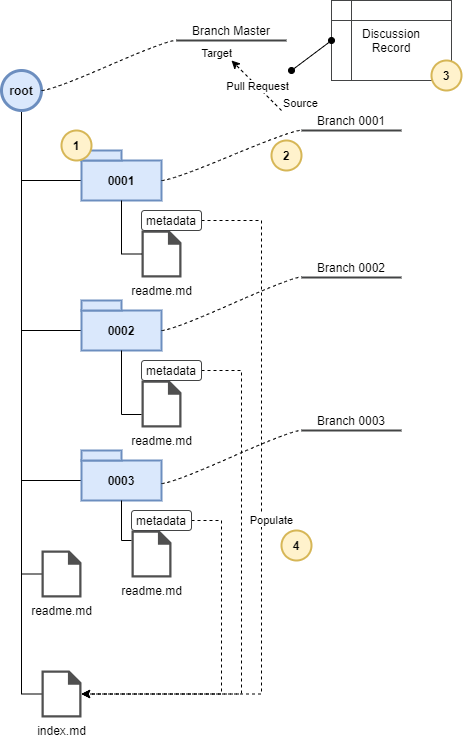

# Requests for Discussion and Tooling

## Introduction

Almost all engineering of note is a social enterprise. A significant contributor to the rate of innovation and general productivity of an engineering team is the rate at which new ideas can be created, discussed, critiqued and improved, and either rejected or (hopefully) accepted and used.

The purpose of a Request for Discussion (RFD) process is to facilitate a lightweight means for raising, discussing, and accepting (or rejecting) ideas, concepts, designs, and decisions. The process and tooling as described here is based on the original W3C RFC process, and *heavily* influenced by [this blogpost](https://oxide.computer/blog/rfd-1-requests-for-discussion).

The following are examples of when an RFD is appropriate, these are intended to be broad:

* An architectural or design decision for hardware or software
* Change to an API or command-line tool used by customers
* Change to an internal API or tool
* Change to an internal process
* A design for testing

## RFD Tools

I'm a naturally lazy person, and the process as described in the original post was a little more arduous than I liked. Manual processes also introduce the chance for human error and/or variation to be introduced, and make it difficult for automation.

So, to facilitate the creation and management of rfd's we've created a simple commandline tool that integrates with Git to automate the initialisation of a repository, creation of an RFD, and management of an RFD process.

## Structure of an RFD and the RFD Repository

An RFD itself begins as a markdown document with a metadata header. The data to be captured includes the authors of the RFD, the state, title, and a link to the thread discussing the RFD. The state indicates where along the process the RFD has progressed, as per the following table. An example is shown below:

    ---
    title: Introduce Request for Discussion Process
    authors: Bob the Builder <bob@thebuilder.co>
    state: discussion
    discussion: <link to discussion>
    ---
*NOTE: This header is critical as it allows automation.*

An RFD repository is structured as follows:

1. Each RFD results in a folder named as per RFD ID, e.g. "0003". The folder holds a readme.md markdown document, and any other content, that describes the RFD. By using the readme.md naming convention, tools and services such as github will automatically display its content.
2. A branch is created and named as per the RFD ID (i.e. in keeping the with the prior example, the branch name is "0003").
3. Discussion on pull a request becomes a record of the changes and updates.
4. The markdown metadata located at the head of the RFD document is used to capture the title, author(s), and other data, and used to populate an index of all RFDs.

When a repository is created, the very first RFD is the RFD process itself, captured in a folder named 0001. A readme.md document in the 0001 folder is copied to the root of the RFD repository, and contains content similar that that found in this document, but targeted at the users of the RFD repository itself.

It is assumed that the process will be used as-is. However, by creating this directory we have provided the ability for others to update their own respective process by (if they wish) creating a "0001" branch and using the RFD process accordingly to capture the associated discussion.

>### Prerequisites
>The following assumes you have installed the RFD commandline tool. If you haven't, [instructions can be found here](#installation).

### Initialising an RFD Repository

Ideally Github or similar is used to hold the RFD repository as you'll be able to take advantage of the default repository rendering and management tools.

The first requirement is to create the repository - [you can find instructions for Github here](https://docs.github.com/en/get-started/quickstart/create-a-repo).

Clone your newly-created repository, [**making sure you use ssh**](https://docs.github.com/en/repositories/creating-and-managing-repositories/cloning-a-repository). This is more secure, and is required for the RFD commandline tool to function.

Once you've cloned your repository, and have installed the rfd commandline tools, ensure you're in the root of the rfd repository, and initialise the empty repository using the init command - 

    $ rfd init

This will:
* Create the 0001 directory, and initialise a templated readme.md into the 0001 directory. The template will be rendered as per information provided in the config.yml file (e.g. organisation name).
* Copy the readme.md file from the 0001 directory to the root of the rfd repository.
* Stage, commit, and push these to the remote repository

## The RDF Process and Lifecycle

*Never at anytime during the process do you push directly to the master branch. Once the pull request (PR) with the RFD in your branch is merged into master, then the RFD will appear in the master branch.*

An RFD progresses through stages that default to the following. Note that these are configurable via the config.yml file (described later).

| State | Description |
|--------|-------------|
|draft|The first draft, can be used to capture the beginnings of a thought, or even just a single sentence so that it's not forgotten. A document in the draft state contains at least a description of the topic that the RFD will cover, providing an indication of the scope of the eventual RFD.|
|discussion|Documents under active discussion should be in the discussion state, with the discussion taking place in an active Pull Request.|
|accepted|Once (or if) discussion has converged and the Pull Request is ready to be merged, it should be updated to the accepted state before being merged into master. Note that just because something is in the accepted state does not mean that it cannot be updated and corrected.|
|committed|Once an idea is being acted on (e.g. being built, coded, or moved into an operational state), it is moved to the committed state. Comments on RFDs in the committed state should generally be raised as issues -- but if the comment represents a call for a significant divergence from or extension to committed functionality, a new RFD may be called for; as in all things, use your best judgment.|
|abandoned|If an idea is found to be non-viable (that is, deliberately never implemented after having been accepted) it can be moved into the abandoned state.|

### 1. Creating an RFD

To create an rfd, simply issue the new command while in the root of the rfd repository i.e.

    $ rfd new

This will:
* Issue a new rfd id based on the highest of the branch id, the id of the local directories, the id of the remote directories, and the highest remote branch id.
* Request information on the title and authors of the rfd (this could potentially be automated by picking up the git user and email details).
* Create and check-out the local branch with the name as per the allocated id
* Create the rfd directory and readme.md file.
* Stage, commit, push, and set the upstream branch of the rfd

When done, you'll automatically be on the new branch. To edit (using the nano editor as an example):

    $ cd 0002
    $ nano readme.md

Of course, you can use whatever editor you're comfortable with.

### 2. Iterate on the RFD in Your Branch

Gather your thoughts and get your RFD to a state where you would like to get feedback and discuss with others. It's recommended to pull and push your branch remotely on a regular basis to make sure the changes you make stay in sync with the remote.

It is up to you as to whether you would like to squash all your commits down to one before opening up for feedback, or if you would like to keep the commit history for the sake of history.

### 3. Discuss Your RFD!
The beauty of this process is that we take advantage of GitOps-style pull requests, so everything is as per the normal git process.

When you are ready to get feedback on your RFD, make sure all your local changes are pushed to the remote branch. Change the status of the RFD to discussion then commit and complete a push:

    $ git commit -am '0004: Add RFD for <Title>'
    $ git push origin 0004

Once pushed, *open a pull request to merge your branch into the master.* After the pull request is opened anyone subscribed to the repo will get a notification that you have opened a pull request and can read your RFD and give any feedback.

The comments you choose to accept from the discussion are up to you as the owner of the RFD, but you should remain empathetic in the way you engage in the discussion.

For those giving feedback on the pull request, be sure that all feedback is constructive. Put yourself in the other person's shoes and if the comment you are about to make is not something you would want someone commenting on an RFD of yours, then do not make the comment.

### 4. Accept (or abandon) the RFD
After there has been time for others to leave comments, the RFD can be merged into master and changed from the discussion state to the accepted state. The timing is left to your discretion: you decide when to open the pull request, and you decide when to merge it - use your best judgment. RFDs shouldn't be merged if no one else has read or commented on it; if no one is reading your RFD, it's time to explicitly ask someone to give it a read!

Discussion can continue on published RFDs! The discussion: link in the metadata should be retained, allowing discussion to continue on the original pull request. If an issue merits more attention or a larger discussion of its own, an issue may be opened, with the synopsis directing the discussion.

Any discussion on an RFD can always continue on the original pull request to keep the sprawl to a minimum.

If you feel your comment post-merge requires a larger discussion, an issue may be opened on it -- but be sure to reflect the focus of the discussion in the issue synopsis (e.g., "RFD 42: add consideration of RISC-V"), and be sure to link back to the original PR in the issue description so that one may find one from the other.

## Installation

TBC